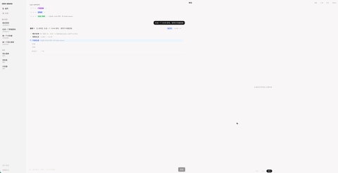

# mini-atoms

> 一个 **AI Agent 驱动** 的应用生成系统。用户用自然语言描述需求，多角色 Agent 流水线自动完成需求澄清 → 架构规格 → 代码生成 → 语法校验 → 沙箱预览，支持**对话式迭代**、**增量修改**与**版本管理**。

**在线体验**: [https://mini-atoms.vercel.app](https://mini-atoms.vercel.app)

## Demo



_输入 "做一个数独游戏" → Agent 流水线自动生成 → 输入 "把背景改成深蓝色" → 基于现有代码增量修改_

📹 [完整录屏演示 (demo.mov)](docs/demo.mov)

---

## 30 秒速览

```
用户: "做一个 2048 游戏，深色主题"
  ↓
[PM Agent] 澄清需求 → 确认游戏机制、交互方式
  ↓
[Architect Agent] 输出规格 → HTML5 Canvas + 原生 JS，4×4 网格
  ↓
[Engineer Agent] 生成代码 → 单文件 HTML，~500 行
  ↓
[Reviewer Agent] 自动校验 → 语法 ✅ 安全 ✅ 结构 ✅
  ↓
沙箱预览 → 可玩的 2048 游戏
  ↓
用户: "把背景改成深蓝色" → 增量修改（Locate→Patch→Apply）→ 版本 2
```

---

## 架构设计

### 系统架构

```
┌─────────────────────────────────────────────────────────────────────┐
│                         用户交互层                                    │
│  ┌──────────┐  ┌──────────┐  ┌──────────┐  ┌──────────┐            │
│  │ 需求输入  │  │ 规格确认  │  │ 对话迭代  │  │ 版本切换  │            │
│  └────┬─────┘  └────┬─────┘  └────┬─────┘  └────┬─────┘            │
└───────┼─────────────┼─────────────┼─────────────┼──────────────────┘
        │             │             │             │
        ▼             ▼             ▼             ▼
┌─────────────────────────────────────────────────────────────────────┐
│                       Agent 流水线引擎                                │
│                                                                      │
│   ┌─────────┐    ┌─────────┐    ┌─────────┐    ┌────────┐          │
│   │  PM     │───→│Architect│───→│Engineer │───→│Reviewer│          │
│   │ 需求澄清 │    │ 规格生成 │    │ 代码生成 │    │ 自动校验│          │
│   └────┬────┘    └────┬────┘    └────┬────┘    └───┬────┘          │
│        │              │              │             │               │
│        └──────────────┴──────────────┘             │               │
│                    Memory 共享                      │               │
│   ┌──────────────────────────────────────────────┐ │               │
│   │ Topic-based Memory Pool                       │ │               │
│   │ • REQUIREMENT  : 用户需求历史                  │ │               │
│   │ • ARCH_SPEC    : 架构规格文档                  │ │               │
│   │ • CODE         : 代码产物                     │ │               │
│   │ • REVIEW       : 校验结果与修复记录            │ │               │
│   └──────────────────────────────────────────────┘ │               │
│                                                     │               │
│   ┌─────────────────────────────────────────────────┘               │
│   │ SOP 路由（按需求复杂度自动选择）                                  │
│   │ • web-app     : clarify→spec→approve→generate→verify→done      │
│   │ • game/tool   : clarify→spec→generate→verify→done（跳过确认）  │
│   │ • fullstack   : 多阶段分层生成（schema→shell→pages→merge）     │
│   │ • modify      : locate→patch→apply→verify（增量修改）          │
│   └─────────────────────────────────────────────────────────────────┘
│                                                                      │
│   ┌────────────────────────────────────────────────────────────────┐│
│   │ Patch 修复循环（最多 5 轮）                                      ││
│   │ 校验失败 → Search/Replace Patch → 应用 → 再次校验               ││
│   └────────────────────────────────────────────────────────────────┘│
└─────────────────────────────────────────────────────────────────────┘
        │
        ▼
┌─────────────────────────────────────────────────────────────────────┐
│                         持久化层                                     │
│  ┌──────────┐  ┌──────────┐  ┌──────────┐  ┌──────────┐            │
│  │ projects │  │ versions │  │ messages │  │ gates    │            │
│  │ 项目元数据 │  │ 版本文件 │  │ 对话历史 │  │ 确认门   │            │
│  └──────────┘  └──────────┘  └──────────┘  └──────────┘            │
│                                                                      │
│  Supabase (PostgreSQL + Row Level Security)                          │
└─────────────────────────────────────────────────────────────────────┘
```

### 核心设计决策

#### 1. 单文件 HTML 架构（当前阶段）

**约束**: `iframe srcDoc` 无 base URL，无法加载相对路径资源。

**方案**:

- LLM 输出结构化 JSON（CodeArtifact），支持多文件组织
- 后端 `mergeToSingleHtml` 自动内联 CSS/JS，合并为单文件
- 前端通过 `srcDoc` 注入 iframe 渲染

**未来扩展**: 接入 WebContainers 或云端沙箱后可升级为多文件项目。

#### 2. Search/Replace Patch 修复

**问题**: 校验失败后完整重写代码，token 浪费且易引入新问题。

**方案**:

```
传统: 生成 → 校验失败 → 完整重写(8万字符) → 校验
 ours: 生成 → 校验失败 → Patch(几百字符) → 校验
```

LLM 输出 `SEARCH/REPLACE` 指令，后端精确替换：

```
<<<<<<< SEARCH
body { background: white; }
=======
body { background: #1a1a2e; }
>>>>>>> REPLACE
```

**收益**: 修复轮次从 2-3 轮降至 1-2 轮，token 消耗降低 90%+。

#### 3. 增量修改小循环（Modify SOP）

**问题**: 用户说"把背景改成蓝色"时，传统方案要么完整重写（慢+贵），要么直接 Patch（锚点匹配率低）。

**方案**: 引入 **Locate→Patch→Apply→Verify** 小循环：

```
Locate（快模型）: "用户要改背景色，目标在第 45 行的 CSS 块"
     ↓
Patch（强模型）: "生成精确的 SEARCH/REPLACE 指令"
     ↓
Apply（零 LLM）: "三级模糊匹配（精确→行尾归一化→忽略缩进）"
     ↓
Verify（零 LLM）: "语法/安全/结构校验"
     ↓
done / fix-patch（最多 5 轮）
```

**收益**: 修改只需几百字符的 Patch，而非完整重写；Apply 三级匹配降低锚点漂移导致的失败率。

#### 4. 对话式迭代

**问题**: follow-up 时 LLM 看不到之前的代码，只能从头生成。

**方案**:

- `sendFollowUp` 将当前版本 HTML 传入后端
- 有现有代码 → 走 **Modify SOP**（locate→patch→apply）
- 无现有代码 → 走完整生成流程
- 追加版本到现有项目，不创建新项目

**效果**: "把背景改成蓝色" → 只改背景色，保留所有游戏逻辑。

#### 5. 多 Provider 降级

**问题**: 单一 LLM 服务不稳定，长内容生成易超时。

**方案**:

| 节点         | 主模型                | 降级路径          |
| ------------ | --------------------- | ----------------- |
| clarify/spec | Qwen 3.6 Flash (快)   | 百炼 Qwen 系列    |
| generate/fix | GLM-5.2 (128K 上下文) | 百炼 Qwen 3.8 Max |
| locate/patch | Qwen 3.8 Max          | 百炼 Qwen 系列    |

GLM-5.2 流式生成 + 实时进度推送，失败自动降级到百炼。

---

## 核心特性

### 🎯 多阶段 Agent 流水线

- **PM Agent**: 需求澄清，提取关键约束
- **Architect Agent**: 输出结构化规格（requirements + constraints）
- **Engineer Agent**: 代码生成，支持结构化 JSON / 纯 HTML 两种模式
- **Reviewer Agent**: 三级校验（syntax → security → structure）

### 🔄 对话式迭代

基于现有代码的增量修改：

```
版本 1: 2048 游戏（白色主题）
  ↓ "把背景改成深蓝色"
版本 2: 2048 游戏（深蓝主题）← 只改了 CSS，游戏逻辑完全保留
  ↓ "加一个最高分记录"
版本 3: 2048 游戏（深蓝主题 + 最高分）← 只加了 localStorage 逻辑
```

### 🛠️ 增量修改引擎（Modify SOP）

| 阶段   | 职责             | 说明                                   |
| ------ | ---------------- | -------------------------------------- |
| Locate | 定位改动范围     | 快模型识别需要修改的代码区域           |
| Patch  | 生成修改指令     | 强模型输出 SEARCH/REPLACE 块           |
| Apply  | 应用补丁         | 三级模糊匹配：精确→行尾归一化→忽略缩进 |
| Verify | 校验修改后的代码 | 语法/安全/结构校验                     |

### 🛡️ 自动代码校验

| 层级      | 校验项                  | 示例                               |
| --------- | ----------------------- | ---------------------------------- |
| Syntax    | JS 语法（acorn）        | `var x = ;` → 第 5 行第 9 列错误   |
| Security  | XSS 向量、危险标签      | `<iframe>`、`javascript:` 协议禁止 |
| Structure | DOCTYPE、外部资源、大小 | `<script src="...">` 禁止、< 200KB |

错误携带精确位置 + 代码片段 + 修复建议，支持 LLM 精准定位。

### 📦 版本管理

- 每次生成创建一个版本
- 版本间可切换预览
- 支持从任意历史版本分叉修改
- 刷新后版本历史完整恢复（含进行中的确认门）
- 支持置顶常用项目
- 删除废弃项目

### 📊 执行过程可解释

- 实时阶段卡片：clarify → spec → approve → generate → verify → done
- 执行日志面板：每个 Agent 的输入/输出/耗时
- 异步代码摘要：generate 阶段每 3 秒刷新"正在做什么"的提示

---

## 技术栈

| 层级       | 技术                                                   |
| ---------- | ------------------------------------------------------ |
| 前端       | Next.js 15 · React 19 · TypeScript · Tailwind CSS      |
| Agent 引擎 | 自研 SOP 引擎 · 多角色 Memory 隔离 · EventBus 实时推送 |
| LLM        | GLM-5.2 · 百炼 Qwen (OpenAI 兼容) · 自动降级           |
| 持久化     | Supabase (PostgreSQL + Auth + RLS)                     |
| 部署       | Vercel                                                 |

---

## 快速开始

### 环境变量

复制 `.env.local.example` 为 `.env.local`，填入：

```bash
# Supabase（持久化 + Auth）
NEXT_PUBLIC_SUPABASE_URL=https://your-project.supabase.co
NEXT_PUBLIC_SUPABASE_ANON_KEY=your-anon-key
SUPABASE_URL=https://your-project.supabase.co
SUPABASE_SECRET_KEY=your-service-role-key

# LLM
GLM_API_KEY=your-glm-key
ANTHROPIC_AUTH_TOKEN=your-bailian-token
ANTHROPIC_BASE_URL=https://dashscope.aliyuncs.com/compatible-mode/v1
```

### 数据库初始化

在 Supabase Dashboard → SQL Editor 执行：

```bash
supabase/migrations/000_core_tables.sql  # projects / versions / messages
supabase/migrations/001_rbac.sql         # profiles / usage / gates
```

### 本地运行

```bash
npm install
npm run dev
```

访问 http://localhost:3000

---

## 测试

```bash
npm test          # 运行全部测试（67 个）
./verify.sh       # TypeScript 编译 + lint + test
```

| 测试模块 | 覆盖内容                                             |
| -------- | ---------------------------------------------------- |
| SOP 引擎 | 正常流程 / 失败重试 / 确认门 / 多轮修复 / Modify SOP |
| 架构隔离 | 角色 Memory 隔离 / CodeArtifact 解析 / Topic 消息池  |
| 代码校验 | 语法 / 安全 / 结构校验 / 错误定位                    |
| 数据库   | 项目 / 版本 / 消息 / 用户 / 限流                     |

---

## 项目结构

```
mini-atoms/
├── src/
│   ├── app/                    # Next.js App Router
│   │   ├── api/               # API 路由
│   │   │   ├── pipeline/      # Agent 流水线 SSE
│   │   │   ├── projects/      # 项目管理
│   │   │   └── users/         # 用户计数
│   │   ├── auth/              # 登录 / 注册
│   │   ├── components/        # UI 组件
│   │   └── hooks/             # useWorkspace
│   ├── lib/
│   │   ├── agent/             # Agent 引擎核心
│   │   │   ├── engine.ts      # SOP 执行引擎
│   │   │   ├── llm-executors.ts  # LLM 调用执行器（含 locate/patch/apply）
│   │   │   ├── patch.ts       # Search/Replace Patch + 三级模糊匹配
│   │   │   ├── sop.ts         # SOP 配置（web-app/game/fullstack/modify）
│   │   │   ├── bus.ts         # Agent EventBus
│   │   │   ├── role.ts        # 角色定义
│   │   │   └── router.ts      # SOP 路由
│   │   ├── db/                # 数据库操作
│   │   ├── llm/               # LLM 客户端
│   │   ├── schemas/           # 类型定义 + CodeArtifact
│   │   ├── verify/            # 代码校验
│   │   └── supabase/          # Supabase 客户端
│   └── tests/                 # 测试
├── supabase/
│   └── migrations/            # 数据库迁移
└── docs/                      # 设计文档
```

---

## 文档

- [CHANGELOG.md](CHANGELOG.md) — 完整迭代日志（35+ PR）
- [docs/spec.md](docs/spec.md) — 系统规格文档
- [docs/constitution.md](docs/constitution.md) — 项目宪法（不可变契约）
- [docs/plan.md](docs/plan.md) — 实施计划与任务拆解
- [docs/manual-test-plan.md](docs/manual-test-plan.md) — 手动测试方案

---

## 演进历程

mini-atoms 在 48 小时笔试期间经历了 **35+ PR** 的持续迭代，核心演进路径：

| 阶段         | 重点                                    | 代表 PR  |
| ------------ | --------------------------------------- | -------- |
| **T0 地基**  | 脚手架、CI/CD、SOP 状态机、校验层       | #13-#15  |
| **核心闭环** | LLM 联调、前端接入、对话式迭代          | #16-#20  |
| **稳定性**   | SSE 心跳保活、流式化、断流兜底          | #29-#33  |
| **持久化**   | 过程数据落库、确认门持久化、刷新恢复    | #27, #31 |
| **复杂任务** | 多阶段 SOP、分层生成、缺页检测          | #32      |
| **增量修改** | Locate→Patch→Apply 小循环、三级模糊匹配 | #34      |

---

## 未来方向

| 方向            | 说明                                          |
| --------------- | --------------------------------------------- |
| 多文件项目      | 接入 WebContainers / Sandpack，突破单文件限制 |
| 专用 Apply 模型 | 像 Cursor 那样用专门模型做代码变更应用        |
| 代码覆盖率测试  | verify 阶段注入测试用例并运行                 |
| 用户反馈循环    | 点击"这个不对"自动触发修复                    |
| 实时协作        | 多人同时编辑同一代码                          |

---

**License**: MIT
